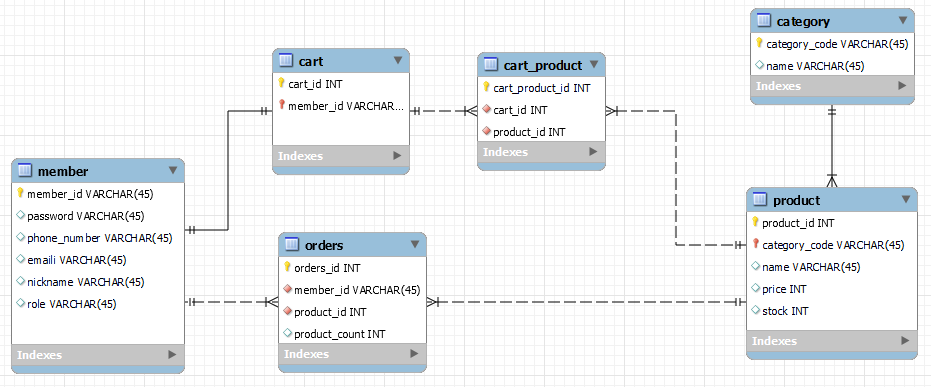

YesMarket
-----
## 목적
- 쇼핑몰 개발에 기본이 되는 기능들을 구현하면서 쇼핑몰 도메인을 이해.
- 개발 단계에서 기능 테스트를 위한 테스트 코드 작성.
- CI / CD를 구현해서 개발에만 집중할 수 있는 환경을 구성.
- 클라우드와 분산 서버 환경에 대한 이해.
- Git Flow 전략으로 브랜치를 관리

## 기술 스택
- Java 8
- Springboot 2.4
- Spring Data JPA
- Gradle
- MySQL 8.0
- Docker
- Jenkins
- Redis
- NginX
- AWS EC2
- AWS RDS

## 주요 이슈
- [DTO는 어떻게 관리하는 게 좋을까?](https://copper-healer-201.notion.site/DTO-d0e1ca7a523c4755aa20d6d9f0fbd9df)
- [Lombok에 @Qualifier 적용하기](https://copper-healer-201.notion.site/Lombok-Qualifier-4b91b0a27ffd422b89a1a0afba1b17a8)
- [Session을 이용한 로그인 구현하기](https://copper-healer-201.notion.site/session-2d14eb5564d34d768b7bf2ea60a10312)
- [Cart와 Product의 다대다 관계](https://copper-healer-201.notion.site/Cart-Product-92044cabeeb94bf9ac7e5515f0cc9d6d)
- [CI / CD 구현하기 - GitHub Webhook, Polling](https://copper-healer-201.notion.site/CI-CD-Github-Webhook-Polling-e62a2c3145cc4c4ea93b9f5968f260de)

## 서버 구성도

## ERD
